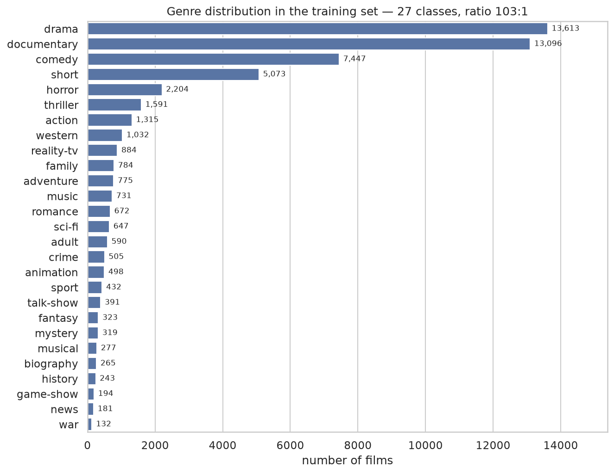
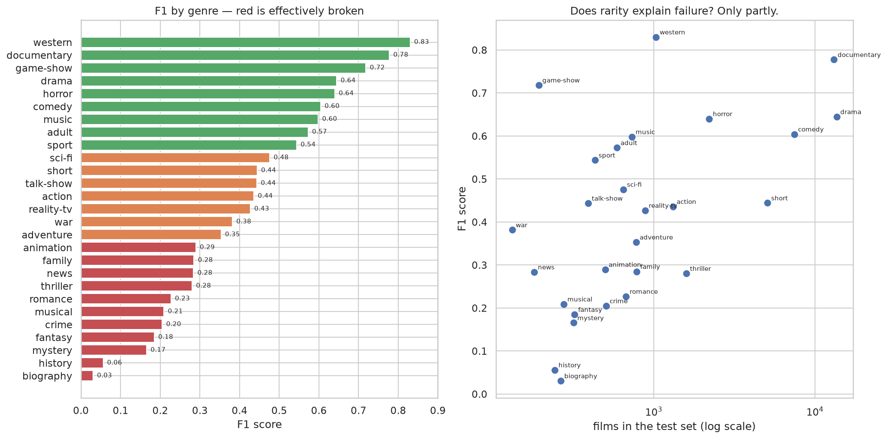
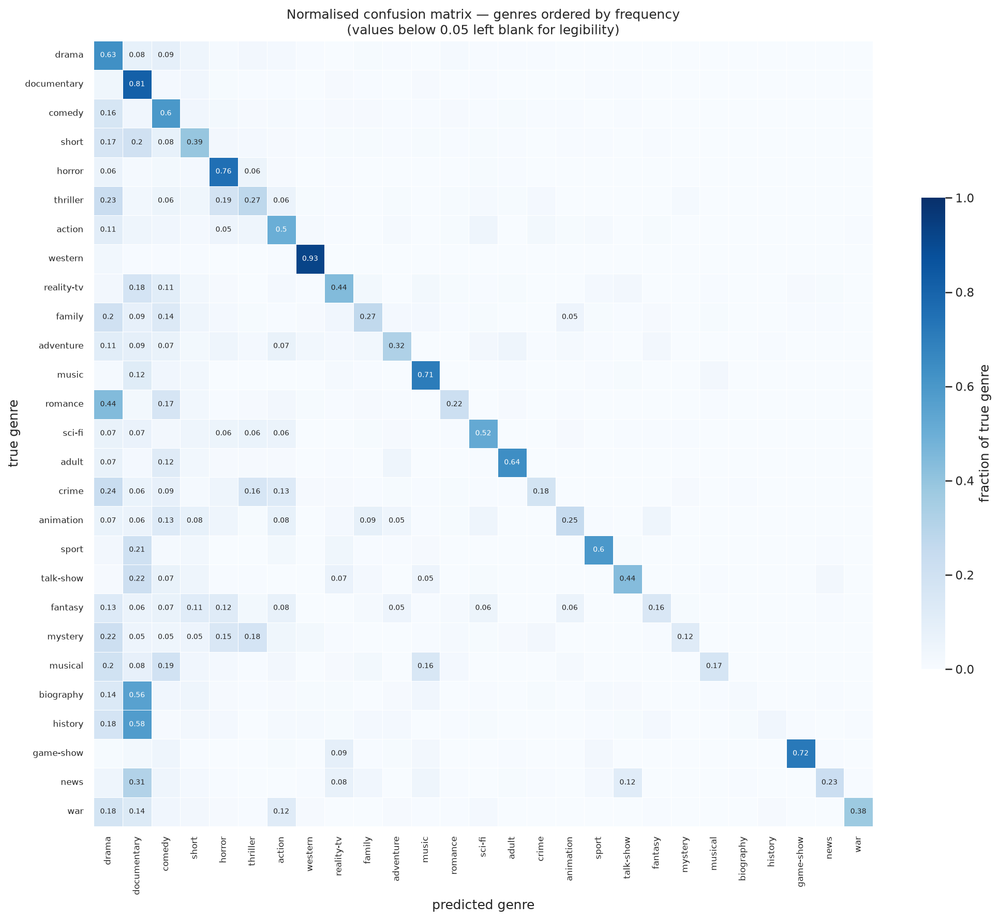
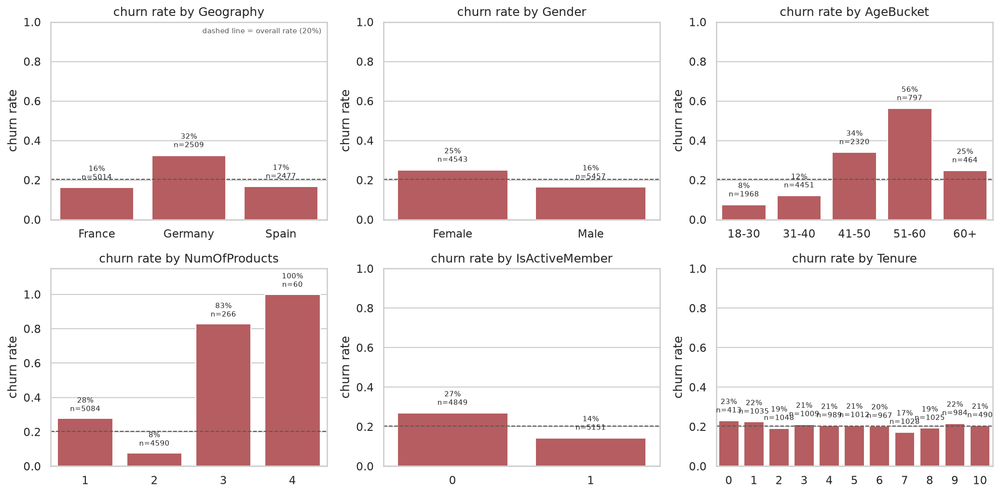
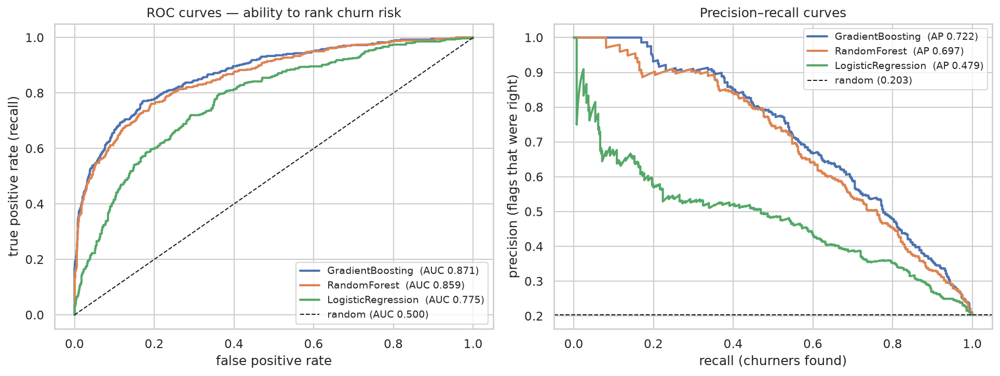
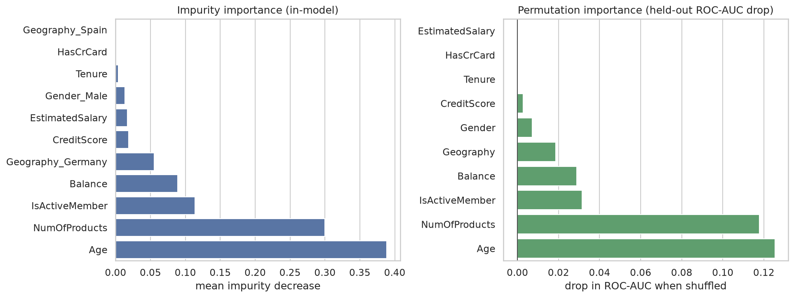

# CODSOFT — Machine Learning Internship

Three machine learning projects completed for the **CodSoft** virtual internship.

Each task lives in its own folder and is fully self-contained: an annotated notebook that walks
through the analysis, a `train.py` that reproduces the model from scratch, a `predict.py` you can
run on new input, and every plot saved as a PNG.

| # | Task | Type | Dataset | Best model | Headline metric |
|---|---|---|---|---|---|
| **1** | [Movie Genre Classification](TASK1_MOVIE_GENRE_CLASSIFICATION/) | NLP · 27-class | [IMDb plots](https://www.kaggle.com/datasets/hijest/genre-classification-dataset-imdb) (54k films) | LinearSVC + word TF-IDF | **macro-F1 0.411** (accuracy 0.603) |
| **3** | [Customer Churn Prediction](TASK3_CUSTOMER_CHURN_PREDICTION/) | Tabular · binary | [Bank churn](https://www.kaggle.com/datasets/shivan118/churn-modeling-dataset) (10k customers) | GradientBoosting + tuned threshold | **ROC-AUC 0.871** (recall 0.678) |
| **4** | [Spam SMS Detection](TASK4_SPAM_SMS_DETECTION/) | NLP · binary | [SMS Spam Collection](https://www.kaggle.com/datasets/uciml/sms-spam-collection-dataset) (5.5k messages) | LinearSVC + character TF-IDF | **spam F1 0.977** (0 false positives) |

Tasks 1 and 4 are both text classification; task 3 is tabular. That mix is deliberate — the three
projects demonstrate different skills rather than the same pipeline three times.

---

## The thread running through all three

**All three datasets are imbalanced, so accuracy is a misleading metric in every one of them.**

| Task | Majority-class baseline | What accuracy hides |
|---|---|---|
| 1 — genre | 25.1% (always "drama") | A model that learns only drama + documentary (49% of the data) and nothing else |
| 3 — churn | 79.6% (always "stays") | Logistic regression scores 80.8% accuracy while finding **19%** of churners |
| 4 — spam | 87.4% (always "ham") | Naive Bayes scores 96.7% accuracy while missing **a quarter** of the spam |

So each task reports the metric that actually measures the thing we care about — macro-F1 for the
27-way genre problem, ROC-AUC and recall for churn, spam-class F1 for the filter — and every one
compares at least three algorithms before picking a winner.

Each project also names its **honest ceiling**, because in all three the remaining error is not
something more tuning would fix:

- **Task 1** — the labels are single-genre but films are not. When the model calls a biography a
  "documentary" it is marked wrong for an answer that is also right.
- **Task 3** — `class_weight="balanced"` leaves ROC-AUC unchanged. It never improved the model,
  it just moved the operating point.
- **Task 4** — the spam that gets through is short, plain-language, and indistinguishable from ham
  on vocabulary alone. Catching it needs signal the dataset does not contain.

---

## Setup

Requires Python 3.11+.

```bash
git clone git@github.com:maasu-23/codsoft.git && cd codsoft

python3 -m venv .venv
source .venv/bin/activate          # Windows: .venv\Scripts\activate
pip install -r requirements.txt
```

### Get the datasets

Datasets are **not** committed (they are gitignored — see `.gitignore`). Download them into each
task's `data/` folder:

```bash
pip install kaggle
# Kaggle -> Settings -> API -> Create New Token, save kaggle.json to ~/.kaggle/
mkdir -p ~/.kaggle && mv ~/Downloads/kaggle.json ~/.kaggle/ && chmod 600 ~/.kaggle/kaggle.json

kaggle datasets download -d hijest/genre-classification-dataset-imdb \
    -p TASK1_MOVIE_GENRE_CLASSIFICATION/data --unzip
kaggle datasets download -d shivan118/churn-modeling-dataset \
    -p TASK3_CUSTOMER_CHURN_PREDICTION/data --unzip
kaggle datasets download -d uciml/sms-spam-collection-dataset \
    -p TASK4_SPAM_SMS_DETECTION/data --unzip
```

Task 1's archive unzips into a `Genre Classification Dataset/` subfolder — move the four `.txt`
files up into `data/` so the scripts find them.

Every `train.py` fails with a clear message and the exact download command if its data file is
missing, rather than inventing anything.

---

## Running the projects

Each task follows the same shape:

```bash
cd TASK4_SPAM_SMS_DETECTION
python train.py                     # trains, prints held-out metrics, saves the model
python predict.py "<your input>"    # loads the saved model and predicts
jupyter lab notebook.ipynb          # the full analysis
```

### Task 1 — Movie Genre Classification

```bash
cd TASK1_MOVIE_GENRE_CLASSIFICATION
python train.py
python predict.py "A gunslinger rides into a lawless frontier town and faces down the cattle baron who murdered his brother."
```

Prints the **top 3 genres with probabilities** — genres overlap heavily here, so a single label
would hide most of what the model knows.

### Task 3 — Customer Churn Prediction

```bash
cd TASK3_CUSTOMER_CHURN_PREDICTION
python train.py
python predict.py --age 52 --geography Germany --gender Female \
    --credit-score 600 --tenure 2 --balance 120000 --num-products 1 --is-active-member 0
```

Every flag defaults to the dataset median/mode, so you can vary one attribute at a time.

### Task 4 — Spam SMS Detection

```bash
cd TASK4_SPAM_SMS_DETECTION
python train.py
python predict.py "Congratulations! You've won a free iPhone, click here to claim"
python predict.py "hey are you coming to class tomorrow"
```

---

## Repository layout

```
codsoft/
├── README.md                 <- you are here
├── CLAUDE.md                 <- project conventions
├── requirements.txt
├── .gitignore                <- datasets and .pkl models are not committed
│
├── TASK1_MOVIE_GENRE_CLASSIFICATION/
│   ├── README.md             <- approach, results, what I'd improve
│   ├── notebook.ipynb        <- the full walkthrough
│   ├── train.py              <- trains and saves the model
│   ├── predict.py            <- CLI for new predictions
│   ├── data/                 <- (gitignored)
│   ├── models/               <- (gitignored)
│   └── results/              <- plots, committed
│
├── TASK3_CUSTOMER_CHURN_PREDICTION/   (same shape)
└── TASK4_SPAM_SMS_DETECTION/          (same shape)
```

---

## Conventions

- `random_state=42` everywhere; every split is stratified.
- Preprocessing lives **inside** a scikit-learn `Pipeline`, so vectorisers and scalers are only ever
  fitted on training folds — never on the data they are evaluated against.
- Every model is saved with `joblib` alongside its held-out metrics, training timestamp and the
  scikit-learn version it was built with.
- Notebooks are committed **with their outputs**, so every number in these READMEs is reproducible
  and traceable to the cell that produced it.

---

## Results at a glance

**Task 1 — Movie Genre Classification**





**Task 3 — Customer Churn Prediction**





**Task 4 — Spam SMS Detection**


---

*CodSoft virtual internship — Machine Learning track.*
