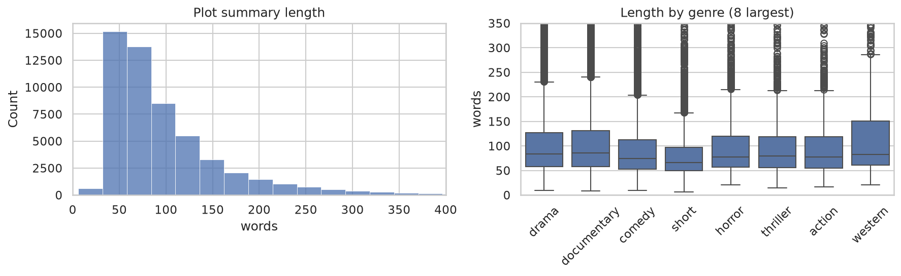

# Task 1 — Movie Genre Classification

Predict a film's genre from its plot summary.

**Dataset:** [IMDb Genre Classification](https://www.kaggle.com/datasets/hijest/genre-classification-dataset-imdb) — 54,214 training films and 54,200 test films across **27 genres**.

The files are `:::`-delimited text, not CSV:

```
ID ::: TITLE ::: GENRE ::: DESCRIPTION
```

Parsed with `pd.read_csv(path, sep=" ::: ", engine="python")` — the C parser only accepts
single-character separators.

---

## Approach

Word-level TF-IDF (1–2 grams, `sublinear_tf`, `min_df=2`, English stop words) over **title +
plot summary** → `LinearSVC(class_weight="balanced")`, in a scikit-learn `Pipeline`.

Evaluated on the dataset's **real held-out test set** using `test_data_solution.txt` — 54,200 films
the model has never seen — not a validation split carved from the training data.

*(Honest note: 91 plot summaries appear in both train and test, 0.168% of the test set. Too small to
move the headline number, but it should be stated rather than discovered later.)*

## Results

| Features | Model | Accuracy | **Macro-F1** | Weighted F1 | Genres ever predicted |
|---|---|---|---|---|---|
| **title + description** | **LinearSVC** | **0.6025** | **0.4114** | 0.5940 | 27 / 27 |
| description only | LinearSVC | 0.5952 | 0.3971 | 0.5871 | 27 / 27 |
| title + description | LogisticRegression | 0.5294 | 0.3939 | 0.5451 | 27 / 27 |
| description only | LogisticRegression | 0.5228 | 0.3852 | 0.5391 | 27 / 27 |
| description only | MultinomialNB | 0.4468 | 0.0486 | 0.3068 | **6 / 27** |
| title + description | MultinomialNB | 0.4462 | 0.0482 | 0.3054 | **6 / 27** |

**Winner: LinearSVC on title + plot** — macro-F1 **0.4114**, accuracy **0.6025**, against a 25.11%
"always predict drama" baseline. Adding the title is worth about 1.4 points of macro-F1.

### Why macro-F1, not accuracy

The class distribution is extreme: drama has 13,613 films, war has 132 — a ratio of **103 : 1**. Drama
and documentary alone are **49.3%** of the dataset, so accuracy is decided almost entirely by those
two genres. Macro-F1 averages per-genre F1 with equal weight, so failing on war costs exactly as much
as failing on drama.

**Look at the last column of the table.** Naive Bayes predicts only **6 of the 27 genres** and never
emits the other 21 at all — every one of those scores an F1 of exactly zero. Its accuracy is still
roughly three-quarters of LinearSVC's, while its macro-F1 is about **one-eighth** of it. That is the
clearest demonstration in this project of why accuracy is the wrong metric.

The cause is NB's class priors: it multiplies its likelihood by *P(genre)*, and with drama at 25% and
war at 0.24% the prior swamps the evidence for every small class. `class_weight="balanced"` is exactly
the correction the linear models get and NB has no equivalent for.


### Per-genre results — where it fails

| Best | F1 | | Worst | F1 |
|---|---|---|---|---|
| western | **0.830** | | biography | **0.031** |
| documentary | 0.778 | | history | 0.056 |
| game-show | 0.718 | | mystery | 0.166 |
| drama | 0.645 | | fantasy | 0.185 |
| horror | 0.640 | | crime | 0.205 |
| comedy | 0.604 | | musical | 0.209 |

**biography and history are near-total failures.** Biography recall is 0.019 — of 264 biographies in
the test set, the model finds five. Both have a blank diagonal in the confusion matrix: it almost
never predicts either label at all.

### It is not simply that rare genres fail

Genre size and F1 correlate at only **ρ = 0.535**. The counterexamples are the interesting part:

| Small but classified well | Large but classified badly |
|---|---|
| western — 1,032 films, F1 **0.83**, the best of all 27 | short — 5,072 films, F1 0.44 |
| game-show — 193 films, F1 **0.72** | thriller — 1,590 films, F1 0.28 |
| sport, music, adult — all under 1,100 films, all above F1 0.54 | action — 1,314 films, F1 0.44 |

The driver is **vocabulary distinctiveness**, not class size. Westerns talk about sheriffs, outlaws,
saloons and the frontier — words that appear nowhere else — so 1,032 examples are plenty. Thrillers
are described with the same words as dramas and crime films, so 1,590 examples do not help.

**Genres defined by setting or subject are learnable from plot text. Genres defined by narrative
structure or emotional tone are not.**


## What the confusion matrix shows is going wrong

The model is **not** making random errors:

| True genre | Predicted as | How often |
|---|---|---|
| history | documentary | 58% |
| biography | documentary | 56% |
| romance | drama | 44% |
| news | documentary | 32% |
| crime, thriller, mystery, family | drama | 20–24% each |
| thriller | horror | 19% |
| musical | comedy | 19% |

Every one is **semantically defensible**. A biography *is* a documentary about a person. A history
film *is* a documentary about the past. A romance *is* a drama in which people fall in love. The
model is not confused about what the film is about — it is collapsing fine-grained genres into the
larger genre they legitimately belong to.


## Why the ceiling is low — and why chasing it is the wrong move

Accuracy in the low 60s is normal here, and the reason is the task definition, not the model:

**1. The labels are single-genre, but films are not.** IMDb lists multiple genres per film; this
dataset keeps one. A film genuinely labelled `["biography", "drama", "history"]` appears as exactly
one of those. When the model predicts "drama" and the label says "biography", it is scored wrong for
an answer that is *also correct*. No amount of modelling fixes a labelling artefact.

**2. Plot summaries genuinely underdetermine genre.** "A young woman returns to her hometown and
confronts her past" is a drama, a romance, a thriller or a horror film depending entirely on
execution — tone, pacing, score. None of that is in the text.

**3. Some genres are not content categories.** `short` is a *runtime*. A short film can be any genre.
The model scores F1 0.44 on it despite 5,072 examples, because there is nothing in the vocabulary to
learn.



## Run it

```bash
python train.py
python predict.py "A gunslinger rides into a lawless frontier town and faces down the cattle baron who murdered his brother."
python predict.py --title "Blood Feast" "A caterer murders young women for an ancient Egyptian rite."
```

```
  1. western        84.8%  ████████████████████████····
  2. short           3.8%  █···························
  3. documentary     1.6%  ····························
```

It prints the **top 3 genres with probabilities** rather than one label, because genres overlap
heavily here and the runner-up is often as defensible as the winner.

`LinearSVC` produces distances, not probabilities, so the saved model wraps it in
`CalibratedClassifierCV`. Unlike a binary problem, on 27 classes this **does** change predictions:

| | Accuracy | Macro-F1 |
|---|---|---|
| uncalibrated LinearSVC | 0.6025 | **0.4114** |
| calibrated (shipped) | **0.6193** | 0.3957 |

Calibration gains accuracy and loses macro-F1, because fitting a sigmoid to the decision values
re-anchors the outputs to the true class priors, partly undoing `class_weight="balanced"`. The model
drifts back toward the large genres. Both numbers are reported rather than only the flattering one;
the headline macro-F1 is the uncalibrated figure, since that is the model the comparison selected.

## What I'd improve with more time

None of the top three is hyperparameter tuning — tuning `C` would buy perhaps a point.

1. **Reframe as multi-label classification** using the original IMDb genre lists, scored with
   per-label F1. This addresses the single largest source of counted error.
2. **Fix the taxonomy.** Drop or merge genres that are not content categories (`short`), and collapse
   pairs the data cannot separate (biography / documentary / history), then report honestly on the
   coarser set.
3. **Try a transformer.** DistilBERT reads word order and context rather than a bag of n-grams;
   expect several points — but it moves the ceiling rather than removing it, since problems 1 and 3
   remain.
4. **Feature union with character n-grams**, which helped substantially on the spam task.

## Files

| File | What it is |
|---|---|
| `notebook.ipynb` | Full walkthrough: parsing, EDA, the six-way comparison, per-genre and confusion analysis |
| `train.py` | Trains the winning pipeline, evaluates on the real test set, saves the model |
| `predict.py` | CLI — top-3 genres with probabilities for a plot summary |
| `results/` | Every plot, as PNG |
