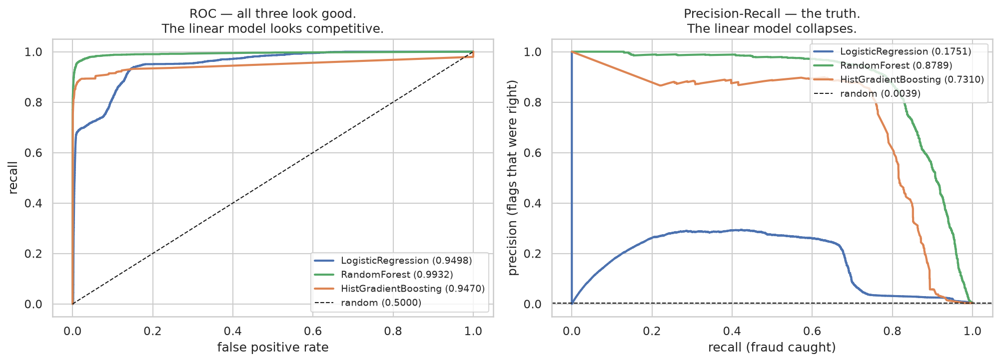
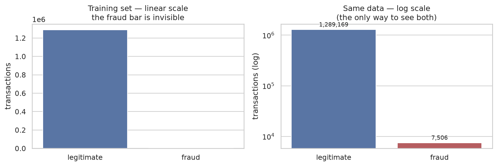
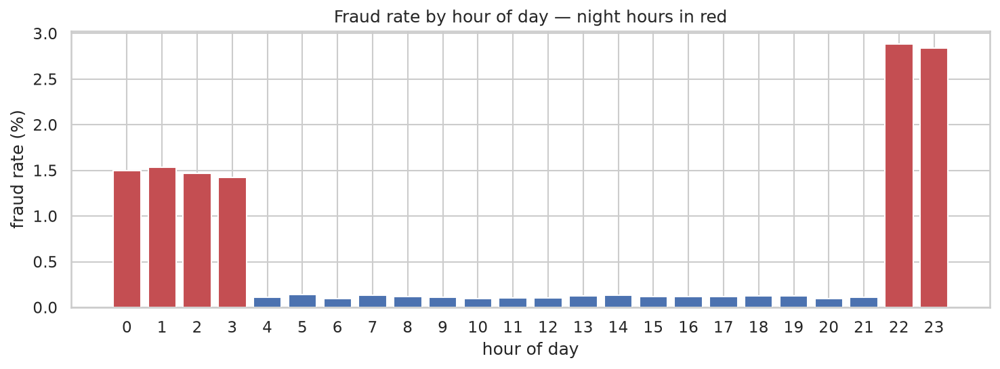
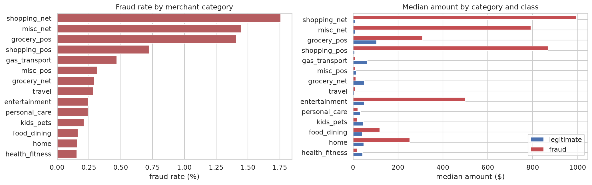
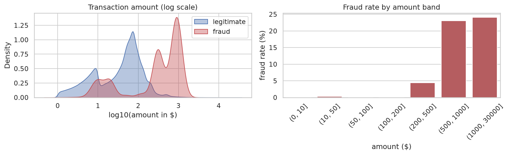
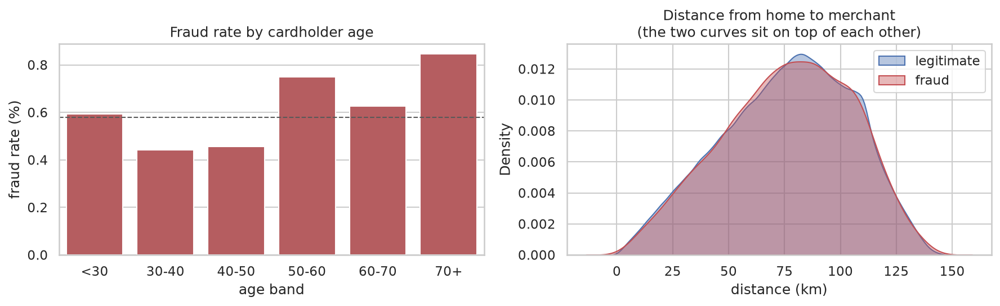
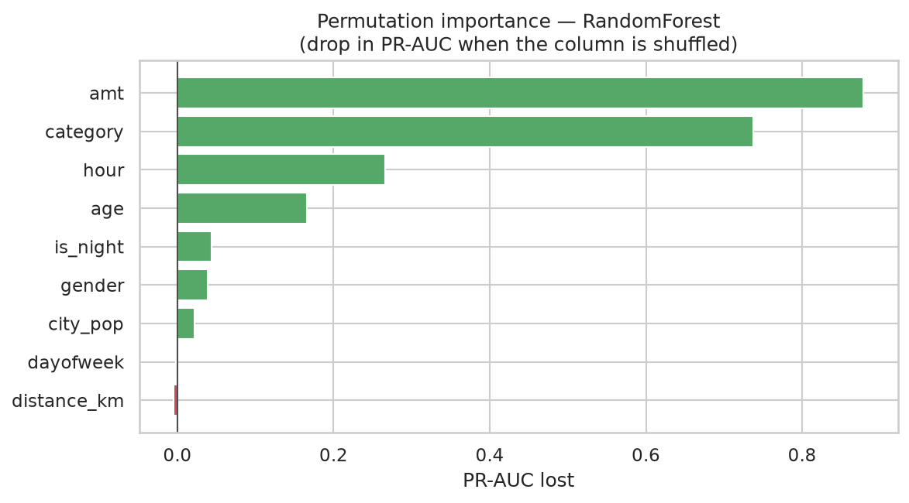
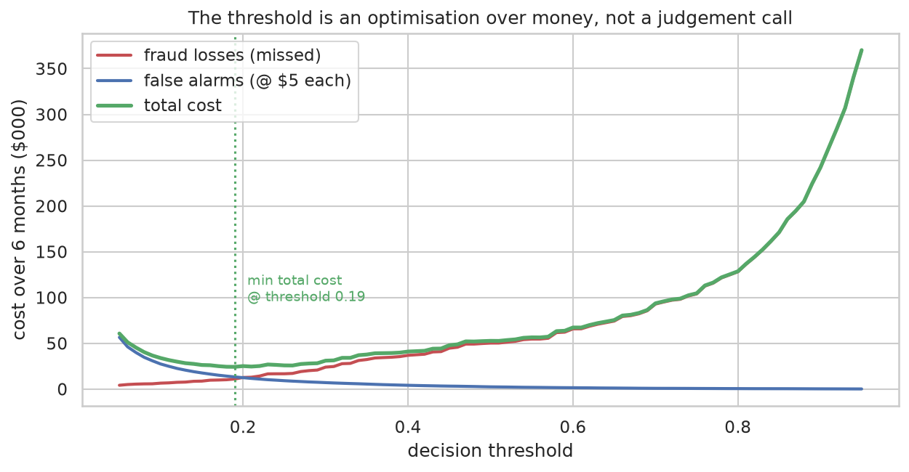
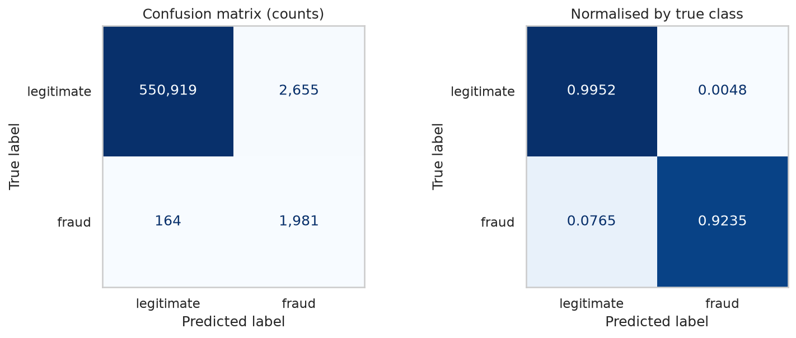

# Task 2 — Credit Card Fraud Detection

Flag fraudulent card transactions from the transaction record and cardholder profile.

**Dataset:** [Fraud Detection](https://www.kaggle.com/datasets/kartik2112/fraud-detection) (Sparkov simulator) — **1,852,394 transactions**, 983 cards, Jan 2019 → Dec 2020.

---

## Approach

Features **engineered** from raw columns → `ColumnTransformer` → **RandomForestClassifier**, with a
decision threshold chosen by minimising expected cost in dollars.

Two things make this task different from the others in this repo.

**The evaluation is temporal.** The dataset ships `fraudTrain.csv` (Jan 2019 – Jun 2020) and
`fraudTest.csv` (Jun – Dec 2020), split at a moment in time rather than at random. That is the honest
way to score a fraud model: in production you train on the past and score transactions that have not
happened yet. A random split would let the model learn from June 2020 to predict January 2020.

**The useful signals are not columns.** Tasks 1, 3 and 4 use their features as given. Here the single
strongest predictor — whether a transaction happened at night — has to be derived from a timestamp,
and cardholder age from a date of birth.

## Results

Temporal holdout: **555,719 transactions** from the six months after the training period.

| Model | Accuracy | ROC-AUC | **PR-AUC** | Precision | Recall | F1 |
|---|---|---|---|---|---|---|
| **RandomForest** | 0.9985 | 0.9932 | **0.8789** | 0.7860 | 0.8322 | 0.8084 |
| HistGradientBoosting | 0.9985 | 0.9470 | 0.7310 | 0.8443 | 0.7459 | 0.7921 |
| LogisticRegression | 0.8624 | **0.9498** | 0.1751 | 0.0251 | 0.9166 | 0.0489 |

*(Precision/recall/F1 at the default 0.5 threshold; the shipped model uses 0.19 — see below.)*

### The finding: ROC-AUC picks the wrong model

Compare **LogisticRegression** and **HistGradientBoosting**:

| | ROC-AUC | PR-AUC |
|---|---|---|
| LogisticRegression | **0.9498** ← higher | 0.1751 |
| HistGradientBoosting | 0.9470 | **0.7310** ← 4x higher |

**ROC-AUC ranks the linear model above the boosted one. PR-AUC ranks it a quarter as good.** Selecting
on ROC-AUC — the metric that worked perfectly well for Task 3's churn problem — would ship the wrong
model here.

At the default threshold that linear model has a precision of **0.0251**: **40 false alarms for every
real fraud it catches**. Its ROC-AUC still reads 0.95.

**Why ROC-AUC breaks.** ROC plots recall against the false positive rate, `FP / (FP + TN)`. With
**553,574 legitimate transactions** in the test set, that denominator is enormous. A model can raise
5,000 false alarms — more than two for every genuine fraud, commercially unusable — and its FPR moves
from 0 to 0.009. The curve barely twitches.

Precision is `TP / (TP + FP)`. `TN` does not appear, so those same 5,000 false alarms crush it
immediately. There is a second difference worth internalising: **a random classifier scores 0.5 on
ROC-AUC regardless of imbalance, but scores the base rate on PR-AUC** — here 0.0039. PR-AUC is
measured against an honest floor.

> **Rule of thumb:** when negatives massively outnumber positives and false alarms cost something,
> use precision–recall. ROC-AUC is for roughly balanced problems.



Left panel: three plausible models. Right panel: the linear model's precision never exceeds ~0.29 at
any recall. Same models, same predictions, different question asked.

### Why accuracy is beyond useless here

Fraud is **0.386%** of the test set, so **"never fraud" scores 99.61% accuracy**. Across this repo:

| Task | Positive rate | "Predict the majority" accuracy |
|---|---|---|
| 3 — churn | 20% | 79.6% |
| 4 — spam | 13% | 87.4% |
| **2 — fraud** | **0.39%** | **99.61%** |



On a linear scale the fraud bar is not small — it is *invisible*. You need a log scale to see that the
minority class exists.

## Feature engineering

| Derived | From | Result |
|---|---|---|
| `is_night`, `hour` | timestamp | **The strongest signal — 18.1x** |
| `age` | `dob` + transaction date | Real, modest, non-monotonic |
| `dayofweek` | timestamp | Weak |
| `distance_km` | home vs merchant lat/long (haversine) | **Nothing — see below** |

### Hour of day: an 18x signal that correlation cannot see

Fraud runs at **2.09%** between 22:00 and 04:00 versus **0.12%** during the day — an **18.1x**
difference, the strongest effect in the dataset.

The Pearson correlation between raw `hour` and `is_fraud` is **+0.0138**. Essentially zero.

The risky window *wraps around midnight*: hours 22, 23, 0, 1, 2, 3 are the top and the bottom of the
numeric range with everything safe in between. Correlation measures a straight line; this is a U with
its ends glued together. **Any feature-selection routine ranking by correlation would discard the best
predictor in the dataset.**

This is the same trap as Task 3's `NumOfProducts` (correlation 0.048 for the strongest feature there),
in a sharper form — and it is why `is_night` is handed to the model explicitly.



### "Large amount = fraud" is wrong as a global rule

Fraud medians run far higher overall (~$397 vs ~$47), but the relationship inverts by category:

| Category | Legit median | Fraud median |
|---|---|---|
| `shopping_net` | $8.30 | **$995.57** (120x) |
| `misc_net` | $9.68 | $792.33 |
| `grocery_pos` | $104.55 | $309.98 |
| `health_fitness` | $42.94 | **$19.80** ← *lower* |
| `gas_transport` | $62.93 | **$10.64** ← *lower* |

What matters is the amount *relative to normal for that category*. A linear model must pick one
coefficient for `amt` and apply it everywhere; a tree splits on category first, then applies a
different amount threshold in each branch. That is a measurable reason to expect trees to win.




### A feature that failed

`distance_km` — distance from the cardholder's home to the merchant — is **dead**: mean 76.27 km for
fraud, 76.11 km for legitimate. The distributions sit on top of each other, and its permutation
importance is slightly *negative*.

I engineered it expecting it to be among the best; "purchase far from home" is textbook fraud
detection. It contributes nothing because the data is **simulated** — the generator draws merchant
locations uniformly around each cardholder regardless of fraud, so the real-world relationship was
never put into the dataset.

It stays in the model and in this writeup as a negative result. Quietly deleting it would hide the
most important caveat about this dataset.



## Is the model actually learning fraud?

A PR-AUC that high on simulated data deserves suspicion first. The specific worry: with only **983
cards**, `age` + `gender` + `city_pop` yields **exactly 983 distinct combinations** — it uniquely
identifies the cardholder. If the simulator concentrated fraud on particular cards, the model could be
memorising *people* rather than learning what fraud looks like.

**Check 1 — does card risk carry across the time boundary?** Spearman between a card's train-period
fraud rate and its test-period rate: **−0.690**. *Negative.* Cards heavily defrauded during training
are, if anything, *less* defrauded afterwards. Memorising identity would **hurt** on this test set,
not inflate it.

**Check 2 — ablation.** Strip out every feature capable of identifying a cardholder:

| Feature set | n | ROC-AUC | PR-AUC |
|---|---|---|---|
| full | 9 | 0.9932 | 0.8789 |
| identity-free (no `age`, no `city_pop`) | 7 | 0.9913 | 0.8014 |
| **transaction-only** (`amt`, `category`, `hour`, `is_night`) | 4 | 0.9859 | **0.7933** |

Four transaction fields alone reach **90% of the full model's PR-AUC**. It is learning transaction
patterns, not people.

### Feature importance



Permutation importance, scored on PR-AUC (shuffle a column, measure the drop):

| Feature | PR-AUC lost |
|---|---|
| `amt` | 0.879 |
| `category` | 0.738 |
| `hour` | 0.267 |
| `age` | 0.166 |
| `is_night` | 0.044 |
| `gender` | 0.039 |
| `city_pop` | 0.022 |
| `dayofweek` | −0.002 |
| `distance_km` | **−0.005** |

**A caveat on reading this.** `is_night` scores far lower than the 18x EDA finding implies — an
artifact of the method, not evidence it is useless. Permutation importance shuffles one column at a
time, and `is_night` is derived from `hour`, which is still present. Destroy one, the model reads the
other. Redundant features always split the credit this way.

`distance_km` has no such excuse — nothing is redundant with it, and its score is negative.

## A limitation worth naming

The headline PR-AUC is strong, but a model can rank well overall and still be wrong about a
particular slice. Taking 200 **real** $900–1000 `shopping_net` transactions from the test set and varying *only* the
hour, against the empirical fraud rate in the same band:

| Time window | Model says | Data says | Gap | |
|---|---|---|---|---|
| 22:00–23:59 | 91.7% | 95.9% | −4.2 | ✓ correctly the riskiest |
| 12:00–21:59 | 71.2% | 46.5% | **+24.7** | ✗ over-rated |
| 00:00–03:59 | 46.3% | 73.8% | **−27.5** | ✗ under-rated |
| 04:00–11:59 | 30.0% | 8.1% | +21.8 | ✓ correctly the safest |

```
model's ranking : 22:00-23:59 > 12:00-21:59 > 00:00-03:59 > 04:00-11:59
data's ranking  : 22:00-23:59 > 00:00-03:59 > 12:00-21:59 > 04:00-11:59
```

**The model gets both extremes right and the middle two backwards.** It ranks the afternoon above the
small hours when the data says the opposite.

Two things to be clear about:

- **This does not invalidate the PR-AUC of 0.879.** That is measured across all 555,719 test
  transactions and reflects how well the model *ranks* them, which it does well. What this shows is
  that its behaviour along one conditional slice is not faithful to the marginal rates.
- **It is not an encoding artifact.** I tested the obvious fix — replacing raw `hour` with a cyclical
  `sin`/`cos` pair, the standard treatment for a feature that wraps around midnight. The inversion
  survives and PR-AUC *drops*. Dropping `hour` entirely and keeping only `is_night` removes the
  inversion but costs about eight points of PR-AUC, because the model can then no longer tell 22:00
  from 02:00.

| Hour encoding | PR-AUC | Inversion? |
|---|---|---|
| `hour` + `is_night` (shipped) | 0.8816 | yes |
| `sin`/`cos` + `is_night` | 0.8717 | yes |
| `is_night` only | 0.7992 | no — but no hour resolution either |

The likely cause is volume: hours 12:00–21:59 carry **654,213** training transactions against
**170,796** for 00:00–03:59, giving the trees far more room to carve fine structure out of the
afternoon — and `class_weight="balanced_subsample"` distorts the probability scale on top of that.

**The practical consequence:** these outputs should not be read as calibrated fraud rates. That is why
the threshold in the next section is chosen by sweeping *observed cost* rather than by trusting the
probabilities to mean what they say, and why calibration is the first item on the improvements list.

## Choosing the threshold — in dollars

Task 3 tuned for best F1 because no costs were given. Here the costs are **on the transaction record**:
a missed fraud costs the transaction amount; a false alarm costs a declined card (modelled at a flat
$5). That makes the threshold arithmetic rather than judgement.



| | |
|---|---|
| Approve everything | **$1,133,325** lost to fraud |
| Best threshold (**0.19**) | **$24,285** total cost — $11,010 fraud + $13,275 alarms |
| **Net saving over six months** | **$1,109,040** |

At that threshold: **recall 92.4%, precision 42.7%**.

| | Predicted legitimate | Predicted fraud |
|---|---|---|
| **Actually legitimate** | 550,919 | 2,655 |
| **Actually fraud** | **164** | 1,981 |

1,981 of 2,145 frauds caught. The 164 missed are worth $11,010. 2,655 false alarms — **0.480%** of
legitimate customers inconvenienced.

*(The $5 false-alarm cost is a stated assumption, not a measurement. The shape of the argument does not
depend on it; the position of the minimum does — which is exactly why that number belongs to the
business and not to the model.)*



## Run it

```bash
python train.py
python predict.py --amount 950 --category shopping_net --hour 2 --age 55
python predict.py --amount 42 --category grocery_pos --hour 14 --age 38

# score the same purchase at every hour — shows the night-time jump directly
python predict.py --amount 950 --category shopping_net --sweep-hours
```

```
  BLOCK — high fraud risk
  fraud probability   23.17%  ███████·······················
  decision threshold 0.19
```

## What I'd improve with more time

- **Velocity features** — what a real system leans on hardest: transactions per card in the last
  hour/day, amount relative to that card's own rolling average, time since the previous transaction.
  These need a `groupby` over card and time computed **causally**, using only each row's past, or they
  leak the future.
- **Validate on real data.** Every conclusion here is conditional on a simulator. The dead distance
  feature is the clearest warning: this dataset's weaknesses are artifacts of how it was generated, and
  the fix is different data, not a better model.
- **Cost-sensitive learning** — pass the transaction amount as a sample weight so the model optimises
  dollars directly instead of counts.
- **Calibration — the first thing I would fix, not the last.** The section above shows the predicted
  probabilities are not faithful to the empirical rates along the hour dimension. A reliability curve
  plus isotonic or Platt scaling would quantify and correct it, and it matters directly because the
  cost analysis prices real decisions off these numbers.

## Files

| File | What it is |
|---|---|
| `notebook.ipynb` | Full walkthrough: temporal split, feature engineering, the ROC-vs-PR argument, leakage checks, cost analysis |
| `train.py` | Trains, tunes the threshold on cost, prints held-out metrics, saves the model |
| `predict.py` | CLI — scores a transaction; `--sweep-hours` shows the night-time effect |
| `results/` | All nine plots, as PNG |
