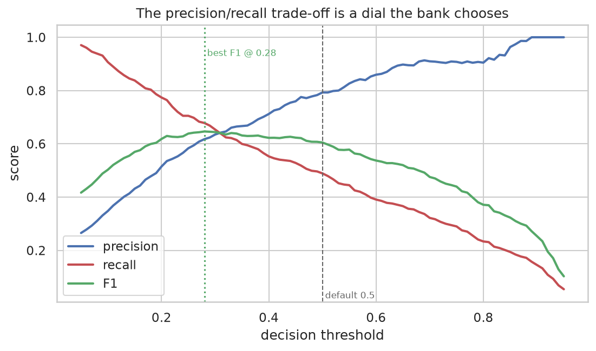
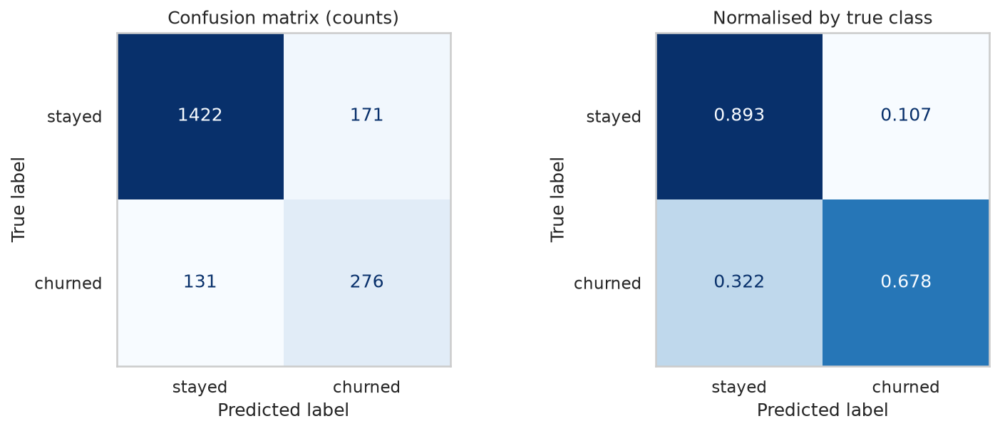
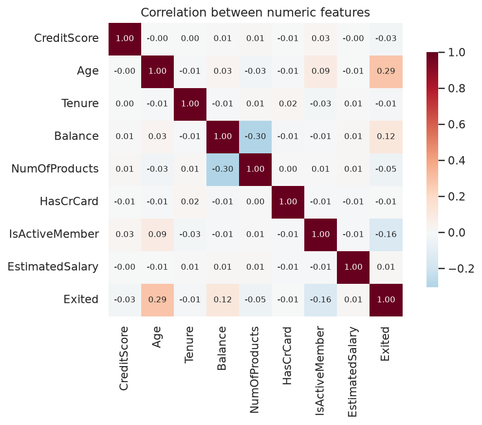
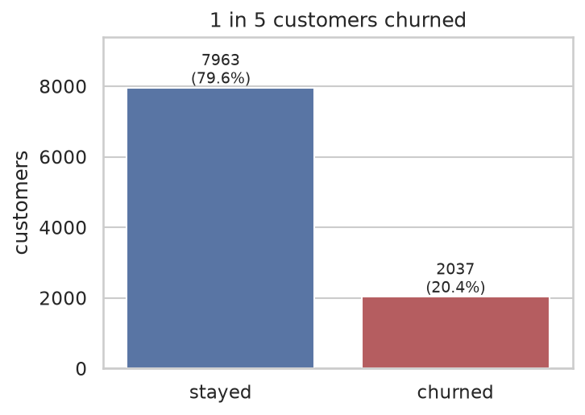

# Task 3 — Customer Churn Prediction

Predict which retail-bank customers will leave, from their account and demographic profile.

**Dataset:** [Churn Modelling](https://www.kaggle.com/datasets/shivan118/churn-modeling-dataset) — 10,000 customers in France, Germany and Spain. Target `Exited`, 20.4% positive. No missing values, no duplicates.

---

## Approach

`ColumnTransformer` (one-hot `Geography`/`Gender`, `StandardScaler` on numerics) → **GradientBoostingClassifier**,
with **default class weights and an explicitly tuned decision threshold of 0.28**.

`RowNumber`, `CustomerId` and `Surname` are dropped first. `Surname` is the one that matters:
2,932 distinct values means a tree can split on a rare surname and "predict" an individual it
memorised in training. It is an identifier wearing a categorical costume.

## Results

Stratified 80/20 split, `random_state=42`, scores on the **churn** class.

| Model | Class weights | Accuracy | Precision | Recall | F1 | ROC-AUC | PR-AUC |
|---|---|---|---|---|---|---|---|
| **GradientBoosting** | default | 0.8700 | 0.7928 | 0.4889 | 0.6049 | **0.8711** | **0.7217** |
| GradientBoosting | balanced | 0.8000 | 0.5057 | 0.7592 | 0.6071 | 0.8690 | 0.7135 |
| RandomForest | balanced | 0.8375 | 0.5919 | 0.6486 | 0.6190 | 0.8587 | 0.6908 |
| RandomForest | default | 0.8680 | 0.7967 | 0.4717 | 0.5926 | 0.8586 | 0.6973 |
| LogisticRegression | balanced | 0.7140 | 0.3878 | 0.7002 | 0.4991 | 0.7772 | 0.4679 |
| LogisticRegression | default | 0.8080 | 0.5891 | 0.1867 | 0.2836 | 0.7748 | 0.4790 |

**Shipped model** — gradient boosting at threshold 0.28:
ROC-AUC **0.8711**, accuracy **0.8490**, churn recall **0.6781**, precision **0.6174**, F1 **0.6464**.

### Why accuracy is misleading here

20.4% of customers churn, so **"nobody churns" is 79.6% accurate** and worth nothing. Logistic
regression with default weights shows the trap: 80.8% accuracy — better than the baseline — while
finding fewer than one churner in five (recall 0.187).

ROC-AUC is the headline instead, because it measures how well the model *ranks* customers by risk
independently of where you cut.

### The main finding: `class_weight="balanced"` is a threshold change in disguise

Compare the two gradient boosting rows. Recall goes 0.49 → 0.76, accuracy drops 7 points — and
**ROC-AUC is unchanged (0.8711 → 0.8690)**. Unchanged AUC means the ranking did not improve. It is
the same model reporting at a different operating point.

The notebook demonstrates this directly: take the *default-weight* model and simply lower its
cut-off until recall matches.

| | Recall | Precision | F1 |
|---|---|---|---|
| `class_weight="balanced"` | 0.7592 | 0.5057 | 0.6071 |
| default weights @ threshold 0.21 | 0.7641 | **0.5353** | **0.6296** |

Same recall, **better** precision and F1. So the shipped model uses default weights and stores the
threshold as an explicit number that can be retuned without retraining.

This reframes the question from "which class weighting?" (a hyperparameter) to "where should the
bank sit on the precision/recall curve?" (a business decision with a numeric answer). We default to
the F1-maximising threshold of 0.28 only because no cost figures were supplied.

### Why logistic regression loses so badly

`NumOfProducts` is the strongest feature and its relationship to churn is a **V**:

| Products | 1 | 2 | 3 | 4 |
|---|---|---|---|---|
| Churn rate | 27.7% | 7.6% | 82.7% | **100%** |

A linear model can fit "more products → less churn" *or* the reverse, not both. A tree splits
`NumOfProducts <= 2` and handles each side separately. Age is non-monotonic too (churn peaks at
56% for 51–60 year olds, then falls for 60+).

This also shows up in the correlation heatmap: `NumOfProducts` has a Pearson correlation with
`Exited` of just 0.048 — near zero — because **correlation measures straight lines and this is a V**.
Selecting features by correlation would have discarded the best one in the dataset.

*(The 100% at four products is only 60 customers — real, but a thin base. Worth flagging to the
business rather than trusting as a stable rate.)*

### What the errors look like — threshold 0.28

| | Predicted stay | Predicted churn |
|---|---|---|
| **Actually stayed** | 1422 | 171 |
| **Actually churned** | **131** | 276 |

276 of 407 churners caught. 131 missed — the silent, expensive failure, since a missed churner costs
the whole relationship. 171 customers contacted who were staying anyway — the cheap failure, one
wasted retention offer each.

### Feature importance


Permutation importance (held-out ROC-AUC drop when a column is shuffled) — more trustworthy than
impurity importance, which is biased toward high-cardinality numeric features:

| Feature | Importance |
|---|---|
| Age | 0.128 |
| NumOfProducts | 0.114 |
| IsActiveMember | 0.032 |
| Balance | 0.026 |
| Geography | 0.018 |
| Gender | 0.008 |
| CreditScore | 0.001 |
| Tenure | 0.0007 |
| EstimatedSalary | 0.0005 |
| HasCrCard | −0.0001 |

**`EstimatedSalary`, `HasCrCard` and `Tenure` contribute nothing.** Shuffling them does not hurt the
model at all. Salary in particular *looks* like it should matter and does not — worth telling the
business, since it is probably in their mental model of churn. Tenure being flat is the surprising
one: length of relationship says nothing about leaving.

Two of the top features are things a bank can actually *change* — `IsActiveMember` and
`NumOfProducts` — unlike age or geography.







## Run it

```bash
python train.py

# a high-risk profile
python predict.py --age 52 --geography Germany --gender Female \
    --credit-score 600 --tenure 2 --balance 120000 --num-products 1 --is-active-member 0

# a low-risk one — every flag defaults to the dataset median/mode, so you can vary one at a time
python predict.py --age 28 --num-products 2 --is-active-member 1
```

```
  HIGH RISK
  churn probability   91.6%  ███████████████████████████···
  decision threshold 0.28 — above this, flag for retention
```

## What I'd improve with more time

- **Cross-validation instead of a single split.** 407 churners in the test set gives a point
  estimate with no error bar.
- **Set the threshold from real costs.** The dial is only meaningful once someone supplies the cost
  of a retention offer and the lifetime value of a saved customer.
- **Investigate the 3–4 product cohort.** An 83–100% churn rate is not a modelling result, it is a
  business incident — probably a product being mis-sold or a fee structure that punishes holding
  several accounts.
- **Ask why Germany is double** (32% vs ~16%) when France and Spain are identical to each other.
  The answer may be worth more than the model.
- **HistGradientBoosting / XGBoost with a randomised search** — likely a point or two of AUC, far
  less valuable than the three items above.

## Files

| File | What it is |
|---|---|
| `notebook.ipynb` | Full walkthrough: EDA, model comparison, the threshold analysis, feature importance |
| `train.py` | Trains, tunes the threshold, prints held-out metrics, saves the model |
| `predict.py` | CLI — churn probability for a customer given as flags |
| `demo.sh` | Self-narrating terminal demo for screen recording — prints its own captions, so a silent recording still explains itself (`--fast` to skip the pauses) |
| `results/` | Every plot, as PNG |
