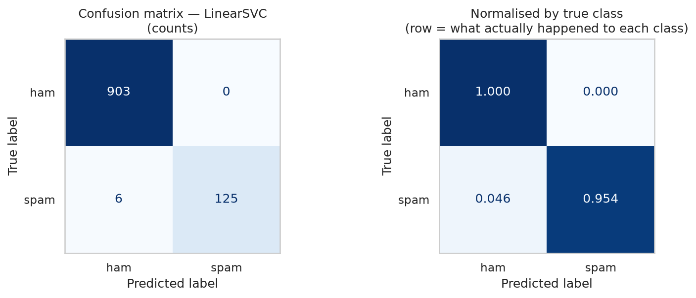
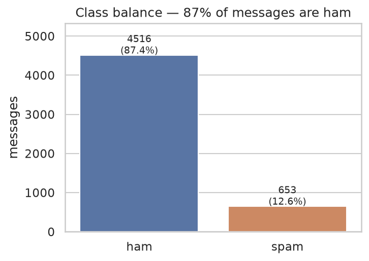
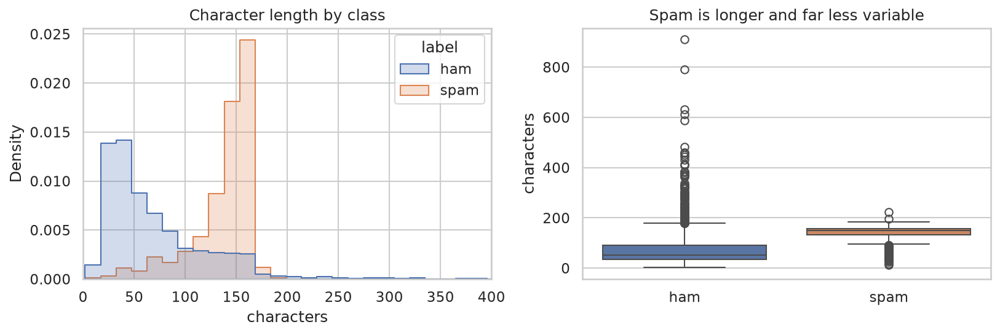
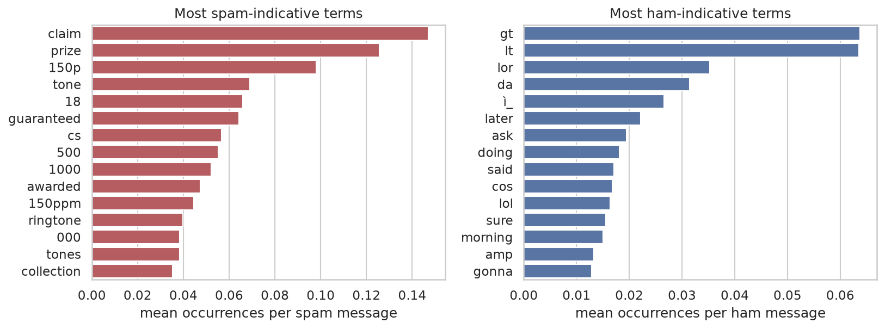
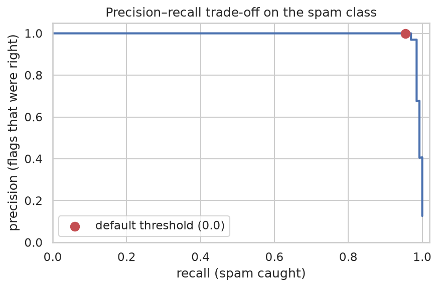

# Task 4 — Spam SMS Detection

Classify an SMS message as **spam** or **ham** (legitimate) from its text alone.

**Dataset:** [SMS Spam Collection](https://www.kaggle.com/datasets/uciml/sms-spam-collection-dataset) — 5,572 hand-labelled real SMS messages (Almeida & Gómez Hidalgo, UCI ML Repository).

---

## Approach

**Character-level TF-IDF → linear SVM**, as one scikit-learn `Pipeline` so the vectoriser is fitted
on the training fold only and travels with the saved model.

Why character n-grams rather than words: SMS spam is adversarial. Spammers write `FR33`, `c-l-a-i-m`,
`W1NNER` specifically to dodge keyword filters. A word-level model sees an unknown token and learns
nothing; `char_wb` 3–5 grams still overlap with the un-obfuscated spelling. It won on every
classifier tested.

Why TF-IDF rather than raw counts: counts are dominated by words common to every message. TF-IDF
down-weights those and normalises each row to unit length — which matters here, because spam is
systematically longer than ham (138 vs 71 characters on average) and an un-normalised model could
learn "long = spam" instead of the actual vocabulary.

## Data cleaning — two things the obvious pipeline gets wrong

**The three "unnamed" columns are not junk.** 50 messages contain a comma inside a broken quote and
were split across `Unnamed: 2/3/4` during the original CSV conversion. Dropping those columns
silently truncates real messages, so we re-join them with the comma that split them.

**403 exact duplicate messages.** Left in, 115 of them land in *both* train and test, so the model
is scored on messages it memorised. We drop duplicates and report it. (Here it barely moved the
number — spam F1 0.9724 → 0.9725 — but that is only knowable after checking.)

## Results

Six combinations, stratified 80/20 split, `random_state=42`. Scores are for the **spam** class.

| Vectoriser | Model | Accuracy | Precision | Recall | F1 |
|---|---|---|---|---|---|
| **char_wb (3,5)** | **LinearSVC** | **0.9942** | **1.0000** | **0.9542** | **0.9766** |
| word (1,2) | LinearSVC | 0.9892 | 0.9858 | 0.9329 | 0.9586 |
| char_wb (3,5) | LogisticRegression | 0.9883 | 0.9722 | 0.9396 | 0.9556 |
| word (1,2) | LogisticRegression | 0.9857 | 0.9586 | 0.9329 | 0.9456 |
| char_wb (3,5) | MultinomialNB | 0.9668 | 1.0000 | 0.7517 | 0.8582 |
| word (1,2) | MultinomialNB | 0.9480 | 1.0000 | 0.6107 | 0.7583 |

**Winner: LinearSVC on character TF-IDF** — macro-F1 **0.9866**, spam F1 **0.9766**.

### Why accuracy is not the metric

The data is 12.6% spam, so *predicting "ham" for everything scores 87.4% accuracy* while catching
zero spam. Naive Bayes shows the trap in miniature: 96.7% accuracy looks fine, but it misses a
quarter of the spam.

Recall is what a filter exists for; precision is whether users trust it. F1 is the harmonic mean, so
it only rises when both do — and unlike recall it cannot be gamed by flagging everything.

### What the errors look like

| | Predicted ham | Predicted spam |
|---|---|---|
| **Actually ham** | 903 | **0** |
| **Actually spam** | **6** | 125 |

Zero false positives — no real message was misfiled, which is the expensive mistake. The six misses
are all *short, plain-language* spam with no prize language or premium number:

> "ringtoneking 84484"
> "Latest News! Police station toilet stolen, cops have nothing to go on!"

These are close to indistinguishable from ham on vocabulary alone. Separating them needs signal this
dataset does not contain — sender reputation, whether the number is in your contacts, time of day —
which is the honest ceiling of a bag-of-n-grams approach, not something more tuning would fix.







## Run it

```bash
python train.py
python predict.py "Congratulations! You've won a free iPhone, click here to claim"
python predict.py "hey are you coming to class tomorrow"
echo "free entry to win FA cup tickets" | python predict.py --json
```

```
  "Congratulations! You've won a free iPhone, click here to claim"
  SPAM   spam probability  88.5%  █████████████████████···

  "hey are you coming to class tomorrow"
   HAM   spam probability   0.1%  ························
```

`LinearSVC` outputs a distance, not a probability, so the saved model wraps it in
`CalibratedClassifierCV` to report a real confidence. Calibration fits a sigmoid over the decision
values without moving the boundary — the metrics above are unchanged (verified in the notebook).

## What I'd improve with more time

- **Cross-validated scores instead of one split.** ~131 spam messages in the test set means each
  error moves recall by most of a point. Repeated stratified k-fold would give an error bar.
- **Feature union of word + character n-grams** — they make different mistakes.
- **Metadata features**: digit ratio, uppercase runs, URL/premium-number presence. Cheap, and they
  attack exactly the failure mode above.
- **Pick the threshold from the precision–recall curve** against a stated cost ratio rather than
  defaulting to 0.5. The curve shows 97% recall is available at 97% precision.

## Files

| File | What it is |
|---|---|
| `notebook.ipynb` | Full walkthrough: cleaning, EDA, the six-way comparison, error analysis |
| `train.py` | Trains the winning pipeline, prints held-out metrics, saves the model |
| `predict.py` | CLI — classifies a message with a confidence score |
| `demo.sh` | Self-narrating terminal demo for screen recording — prints its own captions, so a silent recording still explains itself (`--fast` to skip the pauses) |
| `results/` | Every plot, as PNG |
